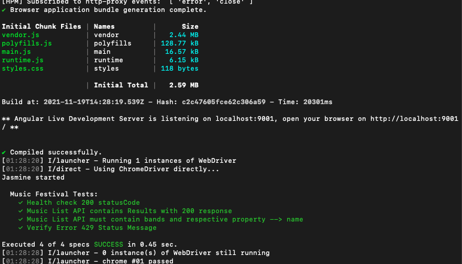

# EA API Automation Task

## prerequisite
- Node v14.15.0
- Npm V6.14.8

## Setup

- git clone https://github.com/testerncoder/ea-automation.git
- cd web
- npm install
- npm run e2e

## Scenaios Covered
- Heath Check - 200 
- Error Status 429 Message validation 
- Required Field Validation

## Future Improvements
- Complete Schema validation
- API performance / Load test
- Penentration / Security Testing
## Results

